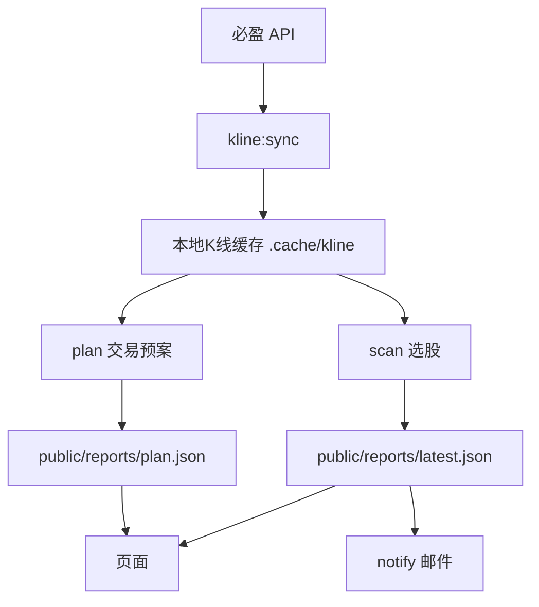

# A Share Money Radar 接入文档

这份文档用于把项目交给新的 AI/开发窗口继续开发。当前目标是：服务器本地沉淀日K和30m K线，选股、交易预案、复盘、页面和邮件涉及 K 线的部分都必须基于本地历史K线运行。除 `kline:sync` 定时任务外，策略脚本不应因为缓存缺失而自动回源调用 K 线接口，避免触发必盈 API 风控。

## 项目地址

- GitHub 仓库：`https://github.com/a0714z/a-share-money-radar`
- GitHub Pages：`https://a0714z.github.io/a-share-money-radar/`
- 服务器页面：`http://112.126.57.131/`
- 服务器公网 IP：`112.126.57.131`

不要把 root 密码、必盈 license、SMTP 密码写入仓库或文档。服务器上的密钥放在 `/etc/a-share-money-radar.env`。

## 服务器目录

- 项目代码：`/opt/a-share-money-radar`
- Nginx 静态目录：`/var/www/a-share-money-radar`
- 页面报告目录：`/var/www/a-share-money-radar/reports`
- K线缓存目录：`/opt/a-share-money-radar/.cache/kline`
- 盘中扫描状态：`/opt/a-share-money-radar/.cache/intraday-state.json`
- 环境变量：`/etc/a-share-money-radar.env`
- Node：`/opt/node-v24/bin/node`
- npm：`/opt/node-v24/bin/npm`

## 关键脚本

在项目根目录执行：

```bash
npm run build
npm run kline:sync
npm run scan
npm run plan
npm run review
npm run notify
npm run intraday:pulse
```

含义：

- `kline:sync`：唯一允许批量拉取 K 线 API 的入口，拉取全市场主板非 ST 的日K、30m K线和市场指数日K，写入本地缓存。
- `scan`：生成选股报告 `latest.json`。默认 `SCAN_SOURCE=history`，直接从本地日K构造收盘报价；日K/30m K 线只读缓存。
- `plan`：生成交易预案 `plan.json`。日K和30m K线只读本地缓存。
- `review`：生成策略复盘 `performance.json`，收益追踪 K 线只读本地缓存。
- `notify`：发送邮件，读取 `latest.json` 和 `performance.json`。
- `intraday:pulse`：盘中分钟级异动扫描，仍使用实时行情接口；股票列表优先读本地缓存。

## 当前数据流



## K线缓存格式

缓存按股票和周期拆文件：

- 股票列表：`.cache/kline/stock-list.json`
- 日K：`.cache/kline/daily/002226.SZ.json`
- 30m：`.cache/kline/30m/002226.SZ.json`
- 指数日K：`.cache/kline/index-daily/000001.SH.json`

单条 K 线使用项目内 `KLine` 类型：

```ts
type KLine = {
  t: string;
  o: number;
  h: number;
  l: number;
  c: number;
  v: number;
  a: number;
  pc?: number;
  sf?: number;
};
```

缓存读写封装在 `scripts/kline-cache.ts`：

- `dailyKLines(client, instrument, limit)`
- `thirtyMinuteKLines(client, instrument, limit)`
- `readKLineCache(frame, instrument, limit)`
- `writeKLineCache(frame, instrument, bars, maxBars)`
- `stockList(client)`
- `mergeKLines(...groups)`

策略脚本不要直接读写缓存 JSON，优先调用这些函数。`dailyKLines()` 和 `thirtyMinuteKLines()` 当前只读缓存，不会自动调用必盈 K 线接口；缓存缺失时应跳过标的或提示先运行 `npm run kline:sync`。`stockList(client)` 只给同步脚本使用，普通策略脚本应读 `readStockListCache()`。

## 关键环境变量

服务器 `/etc/a-share-money-radar.env` 应至少包含：

```bash
BIYING_LICENSE=不要写入仓库

KLINE_CACHE_DIR=/opt/a-share-money-radar/.cache/kline
KLINE_SYNC_DAILY_DAYS=80
KLINE_SYNC_30M_BARS=160
KLINE_DAILY_MAX_BARS=120
KLINE_30M_MAX_BARS=320
KLINE_SYNC_CONCURRENCY=10
KLINE_SYNC_REPORT_PATH=/var/www/a-share-money-radar/reports/kline-cache.json

REPORT_DIR=/var/www/a-share-money-radar/reports
SCAN_REPORT_PATH=/var/www/a-share-money-radar/reports/latest.json
SCAN_HISTORY_DIR=/var/www/a-share-money-radar/reports/history
SCAN_SOURCE=history
SCAN_HISTORY_DAYS=80
SCAN_30M_BARS=160
SCAN_FLOW_DAYS=10
SCAN_FLOW_CANDIDATE_LIMIT=420
SCAN_TOP_N=8
SCAN_MIN_AMOUNT=30000000
SCAN_MAX_PER_SECTOR=2

PLAN_REPORT_PATH=/var/www/a-share-money-radar/reports/plan.json
PLAN_HISTORY_DAYS=80
PLAN_SETUP_WINDOW_DAYS=20
PLAN_30M_BARS=160
PLAN_DAILY_CANDIDATE_LIMIT=260
PLAN_TOP_N=40
PLAN_MIN_AMOUNT=30000000

REVIEW_REPORT_PATH=/var/www/a-share-money-radar/reports/performance.json

INTRADAY_TOP_N=30
INTRADAY_INTERVAL_SECONDS=60
INTRADAY_REPORT_PATH=/var/www/a-share-money-radar/reports/intraday.json
INTRADAY_STATE_PATH=/opt/a-share-money-radar/.cache/intraday-state.json

NOTIFY_SITE_URL=http://112.126.57.131/
NOTIFY_EMAIL_TO=收件邮箱
SMTP_HOST=邮件服务器
SMTP_PORT=465
SMTP_SECURE=true
SMTP_USER=邮箱账号
SMTP_PASS=邮箱授权码
SMTP_FROM=发件邮箱
```

## systemd 服务

已有或建议保留的服务：

- `a-share-pulse.timer`：交易时段盘中分钟扫描。
- `a-share-plan.timer`：盘前/盘后交易预案。
- `a-share-kline-close.timer`：每天 18:00 更新本地 K 线，并基于历史K线生成选股和预案。
- `a-share-morning-notify.timer`：每天 09:00 发送邮件。

查看状态：

```bash
systemctl status a-share-pulse.timer
systemctl status a-share-plan.timer
systemctl status a-share-kline-close.timer
systemctl status a-share-morning-notify.timer
systemctl list-timers 'a-share-*' --all
```

手动运行：

```bash
systemctl start a-share-kline-close.service
systemctl start a-share-morning-notify.service
```

看日志：

```bash
journalctl -u a-share-kline-close.service -n 100 --no-pager
journalctl -u a-share-morning-notify.service -n 100 --no-pager
```

## 部署流程

本地开发完成后：

```bash
npm run build
git status
git add .
git commit -m "..."
git push
```

如果普通 `git push` 因网络重置失败，可以使用 GitHub REST API 更新 `main`。历史上这台机器普通 push 偶尔出现 `Recv failure: Connection was reset`。

服务器部署：

1. 把当前仓库归档上传到 `/tmp/a-share-money-radar.tar`。
2. 解压覆盖 `/opt/a-share-money-radar`，保留 `.cache`。
3. 执行：

```bash
export PATH=/opt/node-v24/bin:$PATH
cd /opt/a-share-money-radar
npm ci --no-audit --no-fund
npm run build
rsync -a --delete --exclude reports dist/ /var/www/a-share-money-radar/
systemctl daemon-reload
```

注意：`/var/www/a-share-money-radar/reports` 是运行时报告目录，部署页面时不要删掉。

## 验证入口

```bash
curl -s http://112.126.57.131/reports/latest.json | head
curl -s http://112.126.57.131/reports/plan.json | head
curl -s http://112.126.57.131/reports/kline-cache.json | head
curl -I http://112.126.57.131/
```

页面验证：

- 首页能打开。
- 交易预案能显示 `plan.json`。
- 个股详情日K和30m K能显示。
- 盘前 09:00 邮件链接应指向 `http://112.126.57.131/#/stock/...`。

## 后续开发建议

优先级最高：

1. 给 `kline:sync` 加“只补最新交易日”的增量模式，减少 18:00 全量拉取压力。
2. 把资金流也缓存起来，当前资金流仍是 `scan`/`plan` 运行时实时取。
3. 页面展示 K 线缓存状态，比如最后同步时间、失败数量、日K/30m/指数覆盖率。
4. 把 `scan` 和 `plan` 共用的“爆量阳线 + 缩量回调 + 30m 承接”逻辑收敛到一个策略模块，避免两套逻辑漂移。

策略重点：

- 爆量柱必须是阳柱。
- 爆量阴柱要减分或进入风险。
- 日K爆量当前要求大于前日 3x。
- 30m 爆量当前要求大于近似基准 5x。
- 形态窗口现在是最近 20 个交易日，日K背景默认保留 80 根。
