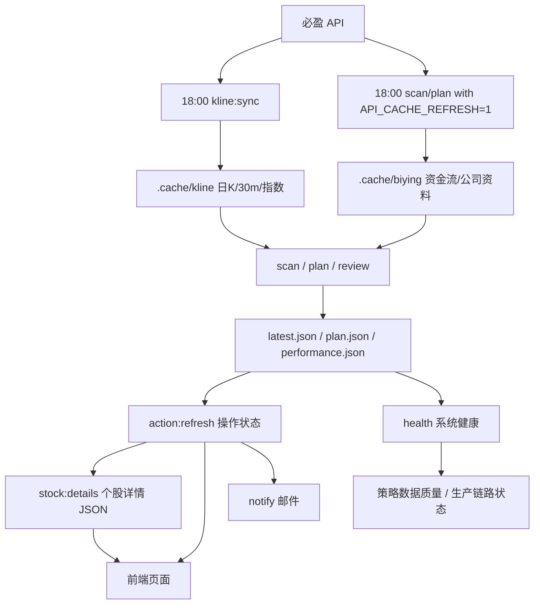

# A Share Money Radar HANDOFF

这份文档给新的 AI/开发窗口接手项目使用。请先读完再动代码，尤其注意必盈 API 风控边界：页面访问、搜索、邮件、复盘都应该读服务器本地 JSON/缓存；不要让用户刷新页面或普通脚本运行时触发必盈接口。

多 agent 协作约定：每次完成开发里程碑或部署验证后，必须同步更新本文件和 `docs/CHANGELOG.md`。`CHANGELOG.md` 记录本次改了什么、验证了什么、是否部署、后续注意点；`HANDOFF.md` 保持接手所需的当前事实。

## 当前目标

平台只服务“主板非 ST、已经出现资金/量价异动、可能需要操作”的股票，不做全市场股票观察系统。核心体验是：

- 每天收盘后固定跑一次数据生产。
- 生成异动票、交易预案、复盘、系统健康、个股详情 JSON。
- 每只异动票给出明确操作状态：可操作、等回踩、继续跟踪、风控提醒、已失效。
- 页面和邮件只展示需要动作或继续跟踪的异动票。

## 仓库和线上地址

- GitHub 仓库：`https://github.com/a0714z/a-share-money-radar`
- 生产页面：`http://112.126.57.131/`
- 旧 GitHub Pages：`https://a0714z.github.io/a-share-money-radar/`

当前生产使用服务器页面。邮件默认详情链接也指向 `http://112.126.57.131/`。

不要把 root 密码、必盈 license、SMTP 授权码写入仓库或文档。服务器密钥在 `/etc/a-share-money-radar.env`。

当前注意：生产 `latest.json` 和策略实验报告都已到 `2026-05-25`，`system-health.json` 为 `ok`。2026-05-25 当日策略结果是主策略 `0` 只、强观察 `1` 只（`002048.SZ 宁波华翔`）、审美池 `7` 只。服务器已按串行请求补足个股日 K 到最多 180 根，少数新股/短历史文件仍不足 120 根是正常现象。策略归档后验追踪和复盘榜单已启用：`2026-05-22` 归档已有 1 个后续交易日，距离 10 日验证还差 9 个交易日；`2026-05-25` 归档还差 10 个交易日；`replay-review.json` 当前汇总 2 个归档日、28 个候选，全部仍在追踪中。`system-health.json` 已新增策略数据质量和生产链路自检：会检查策略归档索引、最新归档 `replayTracking`、`replay-review.json`、策略日期与 latest 交易日是否同步，并在网页“系统状态”展示“策略数据/生产链路”卡片。

## 服务器事实

- 生产代码目录：`/opt/a-share-money-radar`
- Nginx 静态目录：`/var/www/a-share-money-radar`
- 运行报告目录：`/var/www/a-share-money-radar/reports`
- K 线缓存：`/opt/a-share-money-radar/.cache/kline`
- 必盈衍生 API 缓存：`/opt/a-share-money-radar/.cache/biying`
- 环境变量文件：`/etc/a-share-money-radar.env`
- 生产 Node：`/opt/node-v24/bin/node`
- 生产 npm：`/opt/node-v24/bin/npm`

服务器上有 Git，但 `/opt/a-share-money-radar` 不是 Git 仓库，是部署时 rsync 过去的运行目录。系统自带 Node 是 v12，生产脚本必须用 `/opt/node-v24`。服务器内存约 1.6GB、磁盘约 40GB，适合生产部署，不建议作为主要开发工作区。

推荐流程仍是：本地开发 -> 提交 GitHub -> 打包部署服务器。

## 当前定时任务

当前只保留两个 timer：

- `a-share-kline-close.timer`：交易日 18:00，收盘数据生产。
- `a-share-morning-notify.timer`：交易日 09:00，发送邮件。

之前的 `a-share-plan.timer` 和 `a-share-pulse.timer` 已停用，避免非固定时间调用接口。

查看：

```bash
systemctl list-timers 'a-share-*' --all --no-pager
systemctl cat a-share-kline-close.service
systemctl cat a-share-morning-notify.service
```

手动运行：

```bash
systemctl start a-share-kline-close.service
systemctl start a-share-morning-notify.service
```

日志：

```bash
journalctl -u a-share-kline-close.service -n 120 --no-pager
journalctl -u a-share-morning-notify.service -n 120 --no-pager
```

## npm 脚本

项目根目录：

```bash
npm run build
npm run kline:sync
npm run scan
npm run plan
npm run action:refresh
npm run review
npm run strategy:latest
npm run strategy:refresh-replay
npm run stock:details
npm run health
npm run notify:dry
npm run notify
npm run daily:close
```

含义：

- `kline:sync`：唯一允许批量拉取日 K/30m K/指数 K 线的入口。
- `scan`：生成 `latest.json`，默认 `SCAN_SOURCE=history`，日 K/30m K 只读本地缓存。
- `plan`：生成 `plan.json`，日 K/30m K 只读本地缓存。
- `action:refresh`：不调用 API，只给已有 `latest.json` 和 `plan.json` 补操作状态字段。
- `review`：生成 `performance.json`，复盘收益只读本地 K 线缓存。
- `strategy:latest`：读取 `REPORT_DIR/latest.json` 的交易日，生成 `REPORT_DIR/backtests/latest.json`，供前端“策略实验”页签使用；报告外层是当日选股，`benchmark` 字段附带同策略历史基准回测，并写入 `REPORT_DIR/backtests/history` 归档索引。如果该交易日不在本地日 K 缓存，会优先保留已有同日选股并补历史基准，否则退到不晚于报告日的最近缓存交易日并打印 warning。
- `strategy:refresh-replay`：只读本地日 K 缓存，回填 `reports/backtests/history/YYYY-MM-DD.json` 内候选票的 5/10 日后验表现，更新归档索引里的“追踪中/5日已验证/10日已验证”状态，并生成 `reports/backtests/replay-review.json` 策略复盘榜单；不调用必盈 API。
- `stock:details`：生成 `reports/stocks/index.json` 和 `reports/stocks/{instrument}.json`，覆盖候选池、预案池、近期复盘出现过的异动票。
- `health`：生成 `system-health.json`，包含策略实验报告是否与 latest 交易日同步，并检查策略归档索引、最新归档后验追踪、`replay-review.json` 和 daily:close 产物链路日期。
- `notify`：发送邮件，只读本地 JSON。
- `backtest:strategy`：策略回测实验脚本，只读本地 K 线和资金流缓存，不调用必盈 API。
- `cache:plan`：缓存覆盖/补数计划器，只扫描本地缓存和报告，不调用必盈 API。
- `data:bootstrap`：一次性串行补齐研究用日 K、30m K 和资金流缓存。
- `daily:close`：18:00 收盘生产总入口。

当前 `daily:close`：

```bash
npm run kline:sync &&
API_CACHE_REFRESH=1 npm run scan &&
API_CACHE_REFRESH=1 npm run plan &&
npm run action:refresh &&
npm run review &&
npm run strategy:latest &&
npm run strategy:refresh-replay &&
npm run stock:details &&
npm run health
```

## 数据流



## API 风控边界

必须遵守：

- 必盈 API 请求必须串行，不能并发；即使没有 IP 限制，也要遵守证书请求频率限制。
- 页面只 fetch `/reports/*.json` 和 `/reports/stocks/*.json`，不直接调用必盈 API。
- 普通 `scan`/`plan` 的 K 线读取必须走 `scripts/kline-cache.ts`，不自动回源。
- `dailyKLines()` 和 `thirtyMinuteKLines()` 当前只读缓存。
- `moneyFlow` 和 `companyProfile` 只能通过 `scripts/api-cache.ts` 使用。
- 默认只读 `.cache/biying`；只有 `API_CACHE_REFRESH=1` 时才刷新资金流/公司资料 API 缓存。
- GitHub Actions 定时扫描已关闭，不要重新开启会调用必盈 API 的 schedule。

当前 `scripts/biying-client.ts` 通过 `scripts/biying-request-guard.ts` 做全局串行请求队列和请求间隔保护。`scripts/run-kline-sync.ts` 强制 `KLINE_SYNC_CONCURRENCY=1`，30m 历史和 latest 接口也按顺序请求。不要绕过 `BiyingClient` 直接 `fetch` 必盈接口。

当前仍会调用必盈 API 的地方：

- `scripts/run-kline-sync.ts`：stockList、indexHistory、history、history30m、latest30m。
- `scripts/api-cache.ts`：在 `API_CACHE_REFRESH=1` 时调用 moneyFlow、companyProfile。
- `scripts/run-intraday-pulse.ts` 仍有实时行情逻辑，但对应 timer 当前不启用。

## 策略回测实验

当前实验分支：`strategy-backtest-lab`。

目标是把某个历史日期当作“今天收盘”，只用该日期及以前的缓存数据选股，再直接观察后续 5/10 个交易日表现，避免未来函数。当前回测不模拟复杂买卖点；选出即视为收盘后进入观察/可买区。

第一版脚本：

```bash
npm run data:bootstrap
npm run backtest:strategy -- --from 2026-01-01 --to 2026-03-31 --top 10
```

当前波段 preset：

```bash
npm run backtest:strategy -- --preset=swing --from=2025-10-09 --to=2026-05-08 --top=10
```

- `--preset swing` 默认使用当前稳定版：`缩量回踩`、操作状态 `pullback/risk`、5 日大单净流入占比 `1.5%-12%`、120 日分位 `62%-75%`、回撤 `8%-24%`、30m 回踩质量分 `>=80`，且最近 30m 缩量比 `<=0.95`。
- 30m 回踩质量分综合最近 30m 量能收缩、回撤位置、低点是否守住、短均线承接；每个交易日只传入当日及以前的 30m bars，避免未来函数。
- 更宽的候选池可以临时加 `--states=ready,pullback,track,risk,invalid --setups=缩量回踩 --min-value=50 --max-value=78 --min-30m-pullback-score=0.01 --max-30m-shrink-ratio=99`。
- 输出会统计 5/10 日收盘涨跌、未来最高涨幅、最高涨幅日期/第几天、最大回撤，以及未来最高涨幅是否触达 `5%/8%/10%`。
- 输出同时包含 raw 信号统计、默认 `--cooldown-days=5` 的同票冷却去重统计、`main/watch` 分层统计，以及 `daily-ledger.md` 每日选股流水账。
- 分层口径：`pullback/ready` 归为 `main` 主选，`risk` 等其他状态归为 `watch` 观察。
- 审美观察池 `aestheticWatch` 已独立输出，不合并进主策略 summary；当前分为 `接近主策略`、`30m承接审美`、`低位修复观察` 三类，用于吸收用户截图审美里的 30m 平台承接、均线收敛和二次修复特征。
- 强观察池 `strongWatch` 从审美池二次筛选，每日默认最多 5 只；口径优先保留 `30m承接审美`、`低位修复观察`，以及分数特别高的 `接近主策略`。该池用于解决主策略票少、审美池偏泛的问题，独立统计，不合并进主策略。
- 前端“策略实验”页签会读取 `public/reports/backtests/latest.json`、`public/reports/backtests/history/index.json` 和 `public/reports/backtests/replay-review.json`，展示主策略当日选股、强观察池、审美观察池、当日核心候选池、最近信号追踪、策略复盘榜单、历史基准胜率、因子归因、分桶回测、最近每日流水和策略归档。归档日期可在网页上点开，前端再读取 `reports/backtests/history/YYYY-MM-DD.json` 展示当日候选池和 5/10 日后验表现。后续新增策略数据时优先保证网页可见。
- 当日选股可以用 `npm run backtest:strategy -- --preset=swing --select-date=2026-05-22 --top=10`，该模式不要求未来 K 线，结果中的 replay 会显示为 pending。

2026-05-25 本地验证结果：

- `2025-10-09` 至 `2026-05-08`，上一版 swing 默认样本 `77`：5/10 日最高涨幅触达 `5%` 的比例分别为 `46.8%/61.0%`，平均最高涨幅 `6.69%/9.89%`，平均最大回撤 `-5.89%/-7.46%`。
- 同窗口当前 swing 默认版样本 `66`：5/10 日最高涨幅触达 `5%` 的比例分别为 `50.0%/69.7%`，触达 `8%` 比例 `31.8%/48.5%`，触达 `10%` 比例 `21.2%/36.4%`，平均收盘 `+1.04%/+1.86%`，平均最高涨幅 `7.46%/10.53%`，平均最大回撤 `-5.09%/-6.68%`。
- 同窗口默认 5 日冷却去重后样本 `56`：5/10 日最高涨幅触达 `5%` 的比例分别为 `51.8%/71.4%`，平均最高涨幅 `7.34%/10.37%`，平均最大回撤 `-5.00%/-6.73%`。
- 同窗口 `main` 主选样本 `28`：5/10 日最高涨幅触达 `5%` 的比例分别为 `53.6%/67.9%`，10 日平均最高涨幅 `13.01%`；冷却去重后主选样本 `22`，5/10 日触达 `5%` 为 `59.1%/72.7%`，10 日平均最高涨幅 `13.47%`。
- 同窗口 `watch` 观察样本 `38`：5/10 日最高涨幅触达 `5%` 的比例分别为 `47.4%/71.1%`，10 日平均最高涨幅 `8.71%`；适合单列观察，不建议和主选同权处理。
- 同窗口 `140` 个交易日里，有信号日期 `46` 天、空信号日期 `94` 天；5 日冷却跳过重复信号 `10` 条。
- `2026-01-05` 至 `2026-05-08`，当前 swing 默认版样本 `48`：5/10 日最高涨幅触达 `5%` 的比例分别为 `56.3%/75.0%`，触达 `8%` 比例 `33.3%/52.1%`，触达 `10%` 比例 `22.9%/41.7%`，平均收盘 `+2.03%/+2.67%`，平均最高涨幅 `7.74%/11.14%`，平均最大回撤 `-5.29%/-6.52%`。样本仍偏少，不能直接视为实盘收益。
- 同窗口审美观察池样本 `809`：5/10 日最高涨幅触达 `5%` 的比例分别为 `39.7%/55.4%`，默认 5 日冷却去重后样本 `704`，5/10 日触达 `5%` 为 `41.2%/57.4%`。其中 `30m承接审美` 10 日触达 `5%` 为 `60.6%`（样本 `33`），`低位修复观察` 为 `63.6%`（样本 `55`），`接近主策略` 为 `54.5%`（样本 `721`）。该池用于扩展观察，不和主策略同权。
- `2026-05-22` 当日按当前默认版选出 `1` 只：`001223.SZ 欧克科技`，收盘价 `66.12`，原始分 `76.1`，策略分 `126.3`，状态 `pullback/缩量回踩`，5 日大单净流入占比 `1.93%`，120 日分位 `73.7%`，回撤 `10.0%`，30m 回踩分 `106`，30m 缩量比 `0.79`。由于没有未来 K 线，5/10 日 replay 仍为 pending。
- 审美观察池在 `2026-05-22` 默认输出 20 只，其中用户审美样例里的 `600635.SH 大众公用` 被归入 `30m承接审美`，`000837.SZ 秦川机床` 被归入 `接近主策略`；`000591.SZ 太阳能`、`600076.SH 康欣新材` 因资金/失效风险未纳入。
- `strategy:latest` 最新组合报告本地验证：外层当日仍为 `2026-05-22`，主策略 `1` 只、审美池 `20` 只；`benchmark` 覆盖 `2026-01-19` 至 `2026-05-22` 共 `80` 个回测交易日，主策略冷却 10 日最高触达 `5%` 胜率 `77.8%`（样本 `37`，完成 `36`），审美池冷却 10 日胜率 `56.2%`（样本 `679`，完成 `639`）。`system-health.json` 的策略胜率字段优先读取 `benchmark`。
- 强观察池本地验证：`2026-05-22` 当日输出 `3` 只，`600857.SH 宁波中百`、`600635.SH 大众公用`、`002346.SZ 柘中股份`；同一 `2026-01-19` 至 `2026-05-22` 历史基准里，强观察 10 日最高触达 `5%` 胜率 `60.2%`（样本 `135`，完成 `133`），高于审美池 `56.2%`。强观察默认上限 `--strong-watch-top=5`。
- `strategy:latest` 会将组合报告归档到 `history/YYYY-MM-DD.json`，并维护 `history/index.json`；前端策略页的“策略归档”读取该索引。
- `strategy:refresh-replay` 在 `strategy:latest` 之后运行，用最新日 K 缓存回填历史归档 replay。未满 5/10 个交易日时保留 pending 并写入 `availableDays/remainingDays`；满足窗口后写入收盘涨跌、最高涨幅、最高日期、最大回撤和 +5%/+8%/+10% 命中状态。
- `replay-review.json` 汇总归档后验，提供网页上的 `+5%/+8%/+10% 命中榜`、`回撤风险榜`、`仍在追踪`、`接近目标`、按池子拆分表现和最近有效特征。该文件由 `strategy:refresh-replay` 生成，不需要单独跑。
- 前端“因子归因”基于 `benchmark` 的 10 日 replay 现场聚合，当前分桶包含 `30m回踩分`、`30m缩量比`、`5日资金`、`120日分位`、`高点回撤`，审美池额外展示 `审美分桶`。

输出：

- `public/reports/backtests/research-data-bootstrap.json`
- `public/reports/backtests/latest.json`
- `public/reports/backtests/summary.md`
- `public/reports/backtests/daily-ledger.md`
- `public/reports/backtests/benchmark-latest/latest.json`
- `public/reports/backtests/history/index.json`
- `public/reports/backtests/history/YYYY-MM-DD.json`
- `public/reports/backtests/replay-review.json`
- `public/reports/backtests/swing-5-10-final-v2-wide/latest.json`
- `public/reports/backtests/swing-5-10-final-v2-wide/daily-ledger.md`
- `public/reports/backtests/swing-5-10-final-v2-2026/latest.json`
- `public/reports/backtests/signal-2026-05-22/latest.json`

约束：

- `data:bootstrap` 是研究数据集的一次性补齐入口，默认拉取全部主板非 ST 股票 `620` 根日 K、`1200` 根 30m K、`240` 条资金流，以及主要指数约 `1100` 个自然日范围日 K。
- `data:bootstrap` 全程串行请求，已满足数量要求的缓存会跳过；`--force` 才强制重拉。
- `cache:plan` 只作为诊断工具，估算缺口和请求批次，不请求 API。
- 回测脚本只读 `.cache/kline` 和 `.cache/biying`，不导入 `BiyingClient`，不调用必盈 API。
- 每个交易日只使用当日及以前的日 K/资金流缓存。
- swing preset 会使用 30m K 做承接/失效精修，但仍然只读本地缓存并按交易日切片。
- 当前回测是信号表现统计，不做买卖点执行模拟。
- 当前本地报价字段由日 K 近似构造，换手率/量比没有实时行情完整，回测结果用于策略迭代参考，不直接视为实盘收益。

## 关键报告文件

线上报告目录：`/var/www/a-share-money-radar/reports`

- `latest.json`：今日选股/观察/等待。
- `plan.json`：交易预案。
- `performance.json`：历史复盘。
- `kline-cache.json`：K 线缓存覆盖摘要。
- `system-health.json`：系统健康。
- `stocks/index.json`：可搜索的异动票详情索引。
- `stocks/{instrument}.json`：单票详情，例 `stocks/603050.SH.json`。
- `history/YYYY-MM-DD.json`：每日选股归档。

## 操作状态字段

`StockPick` 现在有：

```ts
actionState?: "ready" | "pullback" | "track" | "risk" | "invalid";
actionLabel?: "可操作" | "等回踩" | "继续跟踪" | "风控提醒" | "已失效";
actionReason?: string;
nextPrice?: string;
actionPlan?: {
  state: "ready" | "pullback" | "track" | "risk" | "invalid";
  label: "可操作" | "等回踩" | "继续跟踪" | "风控提醒" | "已失效";
  priority: number;
  summary: string;
  reason: string;
  nextPrice?: string;
  invalidBelow?: number;
  stopLoss?: number;
  positionPct?: number;
};
```

生成逻辑在 `src/lib/scoring.ts`：

- `buildStockActionPlan(pick)`
- `attachActionPlan(pick)`

批量刷新现有 JSON 用 `scripts/run-action-refresh.ts`。这个脚本不调用 API。

页面中的首页和交易预案页都按操作状态筛选。邮件也按操作状态组织。

## 邮件通知

脚本：`scripts/send-email.ts`

当前邮件读取：

- `latest.json`
- `plan.json`
- `performance.json`

当前服务器 `/etc/a-share-money-radar.env` 已配置 `NOTIFY_EMAIL_TO` 和 SMTP 相关变量。2026-05-23 已用 `npm run notify` 发送过测试邮件并返回 message id。

邮件标题格式类似：

```text
A股资金雷达 2026-05-22：可操作2 等回踩13 跟踪6 风控62 失效20 市场震荡 健康收缩
```

正文顶部是“今日操作清单”，优先展示：

1. 可操作
2. 等回踩
3. 继续跟踪
4. 风控/失效

每只票展示现价、涨跌、评分、阶段、结论、关注价、失效位、处理建议和详情链接。`notify` 只读本地 JSON，不调用必盈 API。

本地预览：

```bash
npm run notify:dry
```

真实发送：

```bash
npm run notify
```

## 前端重点

主文件：

- `src/App.tsx`
- `src/styles.css`
- `src/lib/types.ts`
- `src/lib/scoring.ts`

已实现：

- 首屏不再显示样例数据，先 Loading，三份真实 JSON 加载完再显示。
- 专业 K 线图：`lightweight-charts`，支持日 K 和 30m，含成交量。
- 首页“今日选股”按操作状态筛选。
- “交易预案”也按操作状态筛选。
- 详情页顶部显示“当前结论”。
- 搜索框可搜索 `reports/stocks/index.json` 中的异动票详情库。
- 不在今日候选池里的历史异动票可打开历史详情。

注意：平台不追求全市场任意股票查询，只服务异动票和近期历史异动票。

## 环境变量

服务器 `/etc/a-share-money-radar.env` 至少包括：

```bash
BIYING_LICENSE=不要写入仓库

KLINE_CACHE_DIR=/opt/a-share-money-radar/.cache/kline
KLINE_SYNC_DAILY_DAYS=80
KLINE_SYNC_30M_BARS=160
KLINE_DAILY_MAX_BARS=120
KLINE_30M_MAX_BARS=320
KLINE_SYNC_CONCURRENCY=1
KLINE_SYNC_REPORT_PATH=/var/www/a-share-money-radar/reports/kline-cache.json

BIYING_MAX_REQUESTS=0
BIYING_REQUEST_INTERVAL_MS=250
RESEARCH_DAILY_BARS=620
RESEARCH_30M_BARS=1200
RESEARCH_FLOW_ROWS=240
RESEARCH_INDEX_CALENDAR_DAYS=1100

API_CACHE_DIR=/opt/a-share-money-radar/.cache/biying

REPORT_DIR=/var/www/a-share-money-radar/reports
SCAN_REPORT_PATH=/var/www/a-share-money-radar/reports/latest.json
SCAN_HISTORY_DIR=/var/www/a-share-money-radar/reports/history
SCAN_SOURCE=history
SCAN_HISTORY_DAYS=80
SCAN_30M_BARS=160
SCAN_FLOW_DAYS=10
SCAN_FLOW_CANDIDATE_LIMIT=420
SCAN_TOP_N=8
SCAN_MIN_AMOUNT=30000000
SCAN_MAX_PER_SECTOR=2

PLAN_REPORT_PATH=/var/www/a-share-money-radar/reports/plan.json
PLAN_HISTORY_DAYS=80
PLAN_SETUP_WINDOW_DAYS=20
PLAN_30M_BARS=160
PLAN_DAILY_CANDIDATE_LIMIT=260
PLAN_TOP_N=40
PLAN_MIN_AMOUNT=30000000

REVIEW_REPORT_PATH=/var/www/a-share-money-radar/reports/performance.json
STRATEGY_BACKTEST_DIR=/var/www/a-share-money-radar/reports/backtests
STRATEGY_BACKTEST_TOP=10
# 已有同日策略报告时默认跳过，设为 1 可强制重算。
STRATEGY_BACKTEST_FORCE=0
SYSTEM_HEALTH_REPORT_PATH=/var/www/a-share-money-radar/reports/system-health.json
STOCK_DETAILS_DIR=/var/www/a-share-money-radar/reports/stocks

NOTIFY_SITE_URL=http://112.126.57.131/
NOTIFY_EMAIL_TO=收件邮箱
SMTP_HOST=smtp.163.com
SMTP_PORT=465
SMTP_SECURE=true
SMTP_USER=邮箱账号
SMTP_PASS=邮箱授权码
SMTP_FROM="A股资金雷达 <邮箱账号>"
```

## 部署流程

本地：

```bash
npm run build
git status
git add .
git commit -m "..."
git push
```

服务器部署思路：

1. 本地打包仓库，排除 `node_modules`、`dist`、`.git`、`.cache`。
2. 上传到 `/tmp/a-share-money-radar.tar`。
3. 解压到临时目录。
4. `rsync` 覆盖 `/opt/a-share-money-radar/`，保留 `.cache`。
5. 在服务器用 `/opt/node-v24` 安装依赖并构建。
6. 把 `dist/` 同步到 `/var/www/a-share-money-radar/`，必须 `--exclude reports`。

部署命令示意：

```bash
export PATH=/opt/node-v24/bin:$PATH
cd /opt/a-share-money-radar
npm ci --no-audit --no-fund
npm run build
rsync -a --delete --exclude reports dist/ /var/www/a-share-money-radar/
```

如果只是改前端，部署 dist 即可。如果改了脚本或类型，也要同步 `/opt/a-share-money-radar`。

注意：`/var/www/a-share-money-radar/reports` 是运行时报告目录，部署页面时不要删除。

## 验证清单

本地：

```bash
npm run build
npm run notify:dry
```

服务器：

```bash
curl -s http://112.126.57.131/reports/latest.json | head
curl -s http://112.126.57.131/reports/plan.json | head
curl -s http://112.126.57.131/reports/system-health.json | head
curl -s http://112.126.57.131/reports/stocks/index.json | head
curl -I http://112.126.57.131/
```

页面手动验：

- 首页能看到操作状态卡片。
- 今日选股“可操作/等回踩/风控/失效”切换正常。
- 交易预案也能按操作状态切换。
- 个股详情 K 线日 K/30m 正常显示。
- 详情页顶部显示当前结论。
- 搜索历史异动票可以打开 `#/stock/...`。

邮件验：

- `npm run notify:dry` 标题里有 `可操作X 等回踩Y 跟踪Z 风控N 失效M`。
- 详情链接指向 `http://112.126.57.131/#/stock/...`。

## 最近关键提交

- `d83045c`：邮件改为操作清单。
- `ca1d83a`：交易预案页按操作状态筛选。
- `37f6d29`：给异动票生成操作状态。
- `b54fe41`：生成个股详情 JSON 和搜索索引。
- `0ac68ba`：首页增加决策分层。
- `078799b`：资金流/公司资料缓存和系统健康。
- `54efe1a`：关闭 GitHub 定时扫描。
- `d2a9fa3`：前端 Loading，不再先显示样例数据。

## 下一步建议

1. 优化 `buildStockActionPlan()`：当前部分 `风险提醒` 可能过于保守，尤其预案高分票容易因风险文字进入风控。可结合真实复盘调整阈值。
2. 邮件中“可操作”如果仓位为 0，需要检查 `positionPct` 逻辑是否符合用户预期；可能需要让 `ready` 默认给最小观察仓位。
3. 给 `kline:sync` 做增量同步，只补最新交易日，减少 18:00 全量 API 压力。
4. 把操作状态写入 `system-health.json` 摘要，页面系统状态可直接显示“可操作/等回踩”数量。
5. 做操作状态复盘：统计 `ready/pullback/risk/invalid` 后续 3/5/10 日表现，用真实结果调规则。
6. 继续保持“只做异动票”，不要扩成全市场任意股票系统，除非用户明确改变目标。

## 重要原则

- 不要恢复 GitHub Actions 定时 API 扫描。
- 不要让页面请求触发必盈 API。
- 不要把服务器密钥写入仓库。
- 不要删除 `/var/www/a-share-money-radar/reports`。
- 不要把 `/opt/a-share-money-radar/.cache` 覆盖掉。
- 生产服务器不是主要开发环境；优先本地开发、GitHub 提交、服务器部署。
